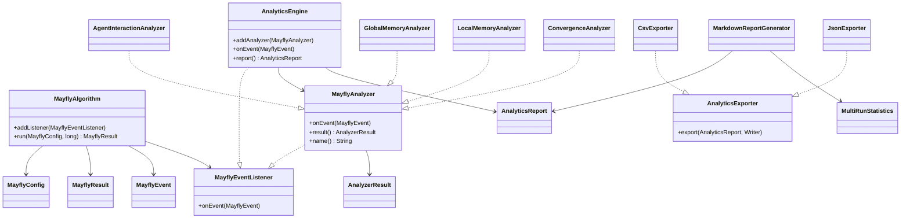
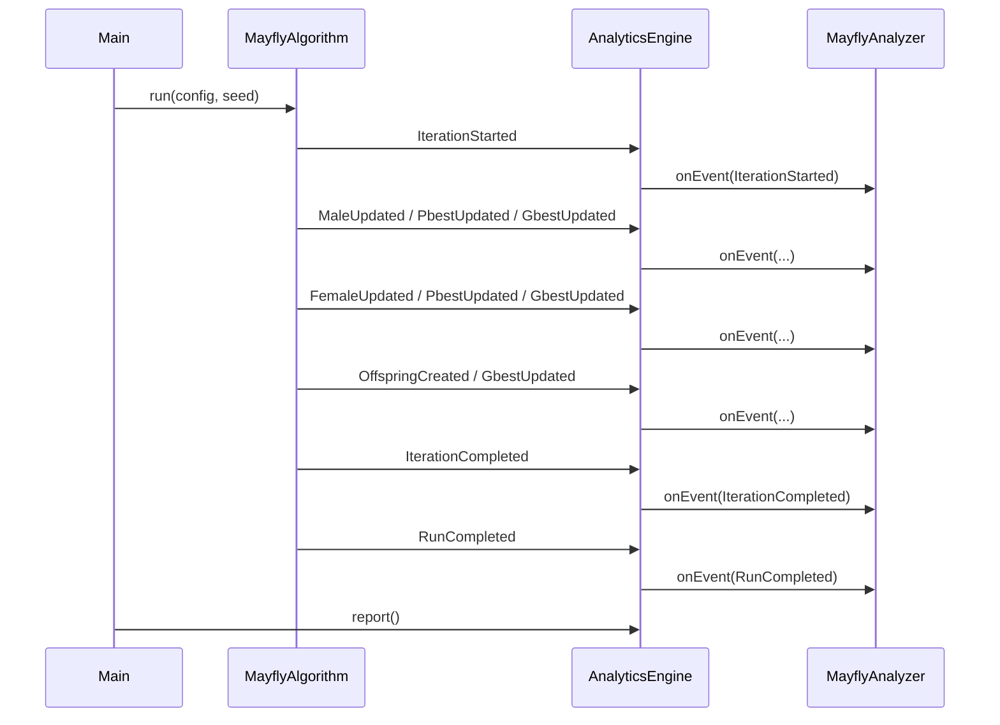

# Architecture

## Overview

`mayfly-analytics` is a Java 25 project around the Mayfly Algorithm. The algorithm minimizes the 10D Ackley function. During a run it emits events. The analytics engine listens to these events and forwards them to analyzers.

The project stays single-threaded. This is intentional because the assignment forbids concurrency and because deterministic behavior is easier to check with fixed seeds.

## Component Diagram



## Iteration Sequence



## Components

- `MayflyAlgorithm`: Runs the Mayfly Algorithm. It owns no run state after `run(...)` finishes except registered listeners.
- `MayflyConfig`: Record containing dimensions, bounds, population size, iteration count, and algorithm parameters.
- `MayflyResult`: Immutable result record with defensive copying of `gbestPosition`.
- `MayflyEvent`: Sealed interface for events emitted during the algorithm run.
- `MayflyEventListener`: Listener interface with `onEvent(MayflyEvent)`.
- `UpdateSource`: Enum for global-best update origin: `MALE`, `FEMALE`, or `OFFSPRING`.
- `AnalyticsEngine`: Receives algorithm events and forwards them sequentially to analyzers.
- `AnalyticsReport`: Record containing analyzer results, timestamp, config, and seed.
- `MayflyAnalyzer`: Interface for analyzers. It extends `MayflyEventListener` and adds `result()` and `name()`.
- `AnalyzerResult`: Marker interface for analyzer result records.
- `AgentInteractionAnalyzer`: Tracks nuptial dances, attraction counts, female attraction rates, pair distance, and interaction histogram.
- `GlobalMemoryAnalyzer`: Tracks global-best trajectory, update count, source distribution, improvement deltas, stagnation streaks, and first hitting iteration.
- `LocalMemoryAnalyzer`: Tracks pbest update counts, mean pbest improvement, pbest position diversity, and pbest fitness distribution.
- `ConvergenceAnalyzer`: Tracks convergence curve, population diversity, threshold iteration, plateau segments, and convergence rate estimate.
- `AnalyticsExporter`: Interface for writing an `AnalyticsReport` to a `Writer`.
- `CsvExporter`: Writes a simple section/key/value CSV report.
- `JsonExporter`: Writes a manually serialized JSON report.
- `MarkdownReportGenerator`: Builds a readable markdown report with tables, a sparkline, and a Mermaid diagram.
- `MultiRunStatistics`: Calculates mean, median, standard deviation, quartiles, and a 95 percent confidence interval.

## Export Schema

### CSV

The CSV format is simple:

```text
section,key,value
config,dimensions,10
run,seed,42
global-memory,gbestUpdateCount,525
```

The first column identifies the report section. The second column is the metric name. The third column is the value.

### JSON

The JSON root object contains:

```text
config
seed
generatedAt
analyzers
```

`config` contains the main configuration values. `analyzers` is an object keyed by analyzer name. Each analyzer contains only selected key metrics, not every internal detail.

JSON is serialized manually. Strings are escaped, lists and maps are written recursively, and non-finite floating point values are written as `null`.

### Markdown

The markdown report contains:

- title
- run table with seed, timestamp, and tool versions
- configuration table
- one section per analyzer
- selected metrics in tables
- Unicode sparkline for the global-best curve
- Mermaid convergence diagram
- multi-run statistics table

## Determinism and Runtime Rules

- The algorithm uses a deterministic seed through `run(MayflyConfig config, long seed)`.
- The random generator is `RandomGeneratorFactory.of("Xoshiro256PlusPlus").create(seed)`.
- Java 25 is used.
- Preview features are not used.
- Concurrency is not used.
- Allowed libraries are Lombok, JUnit 5, AssertJ, JGiven, and JaCoCo.
- No external JSON library is used.

## ADR 1: Sealed Interface for Events

Decision: `MayflyEvent` is a sealed interface with record implementations.

Reason: The event set is fixed by the assignment. A sealed interface makes the allowed event types explicit and keeps event handling readable. Records are enough because events are simple data carriers.

Consequence: Adding a new event requires changing the sealed interface. That is acceptable here because the project has a small, known event model.

## ADR 2: Listener-Based Analytics Instead of Console Output

Decision: The algorithm emits events and does not calculate analytics directly.

Reason: The original algorithm printed progress inside algorithm logic. For analytics and tests this is not clean. Listener events keep the algorithm runnable without console output and allow analyzers to collect data independently.

Consequence: The algorithm has a small listener list. The analyzers must interpret events correctly, but the algorithm does not need to know about each analyzer.

## ADR 3: Manual JSON Export

Decision: JSON is written manually.

Reason: The assignment forbids Jackson, Gson, org.json, and other third-party JSON libraries. The required schema is small, so a simple writer is enough.

Consequence: The exporter is not a full general-purpose JSON serializer. It only supports what the project needs: strings, numbers, booleans, lists, maps, and null.

## ADR 4: Single-Threaded Execution

Decision: The project stays single-threaded.

Reason: The assignment forbids concurrency. Also, deterministic event order matters for tests and reproducibility.

Consequence: Multi-run statistics are calculated in a loop. This is slower than parallel execution but simpler and compliant.
